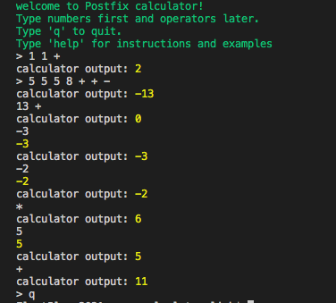
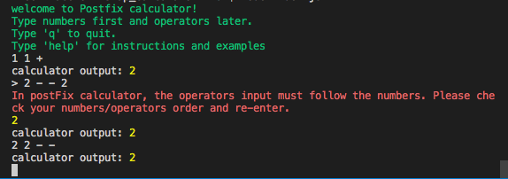
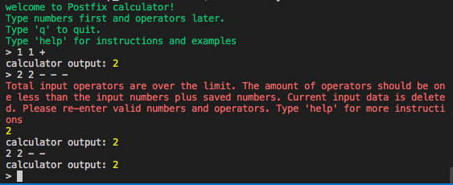

# Postfix Calculator

:tv: A command line postfix calculator app build upon node.js

## Description

- Use 2 sets of arrays to store numbers and operators. CMD-Line Inputed numbers will be stacked in numArr. LILO: the last 2 elements perform arithmetic operation, their result pushed to the end of numArr array and repeat the operation until operator array is empty. CMD-line inputed operators(+, -, \*, /) will be quecued in operArr. FIFO: the first operator in the array will be served first until operArr is empty.

- CalcLogic() function defines arithmetic logic and performs arithmetic operations
- Choose an asynchronous calcInput() function to manage user interactive runtime command line input/output. Did not use recursive function to manage interactive runtime input. JavaScript Promise's Async/await is more efficient to manage. Recursive function also consumes more memory space and time comlexity.

- Use ReadLine module to obtain bash terminal command line input string
- CalcUtility() function manages calcuator features to improve user experience, such as command line instructions and demo input/output examples. More features can be added here base on users feedbacks.
- InputStrValidation() funciton validate the current user input. Provide user options to re-enter corrected data.
- OperLimitValidation() function validate operator limits. Operators must be less then the total numbers - 1

- Enter postive & negative number input: Converting the cmdLine input into a mixed array is necessary becuase each array element is able to be identified as negative/postive number or minus/plus operator. Identifying each string with the same way is more much complex.

- Input data validation 1: if user mixed operators inside numbers, inputStrValidation() function will not process data and console log a message to remind user to enter correct data.

  

- Input data validation 2: If user add operators more than the numbers can operate, operLimitValidation() function will console log a message to ask user re-enter. The function will remove the the numbers and operators user just entered.

  

- :white_check_mark: Add text colors for command line output messages

- :white_check_mark: Calculator utility features 1 - add 'clear' command for user to clear up all numbers 'saved' in calculator

- :writing_hand: Calculator utility features 2 - user might want an undo command to undo clear-all-data.

- :writing_hand: User instruction and examples: need more details content, better format and colors.

- :writing_hand: Decimal place: base on user feedback.

- :writing_hand: add a message for user when readline module exit

### Build With

- Node.js
- JavaScript
- Readline module
- chalk

## Getting started

- Clone the repo on local drive and run npm install

## Executing program

- Inside cloned local repo folder, run: node calc.js
- Follow the command prompt instructions.
- Type 'help' for instructions and examples
- Type 'q' to quit the app.

## Version History

- 1.0.0 Initial Release
